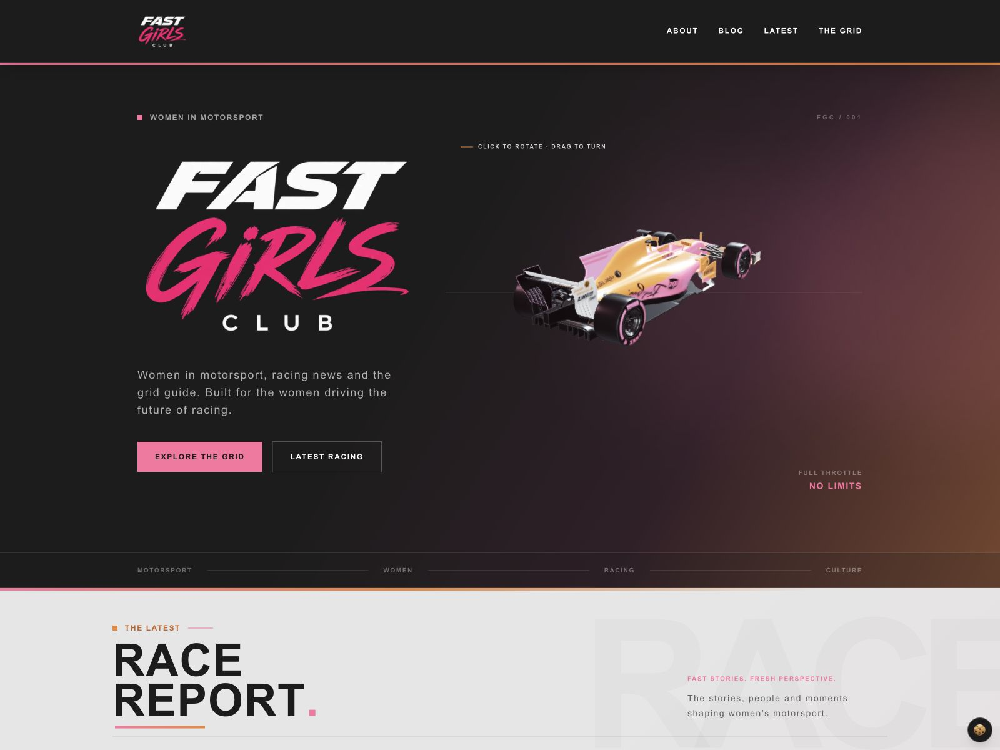
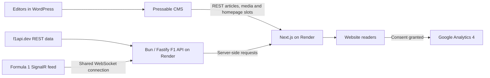

<div align="center">

# Fast Girls Club

**Women in motorsport. Fast stories. A different lens on the grid.**

A bespoke motorsport publication combining a WordPress newsroom, an animated Next.js website and a purpose-built Formula 1 data service.

[Explore the website](https://fastgirlsclub.co.uk/) · [Read the stories](https://fastgirlsclub.co.uk/blog) · [Enter The Grid](https://fastgirlsclub.co.uk/f1)



*The live homepage: an interactive branded car, editorial typography and the Fast Girls Club racing identity.*

</div>

## The experience

Fast Girls Club puts women in motorsport front and centre, with an editorial website built around racing news, culture and community. The site includes:

- A racing intro with the brand logo, starting lights and a drifting 3D car, followed by the homepage entrance animations.
- An interactive hero car, directional scroll animations and responsive layouts that respect reduced-motion preferences.
- **Race Report**, with three editorial positions controlled from WordPress, and a searchable, filterable, paginated blog.
- **The Grid**, with race-weekend schedules, driver and constructor standings, the calendar, live timing and previous-race classifications.
- Shared navigation, article animations, the pink-to-orange navbar line and a small 🍪 control for analytics preferences.

Latest always goes directly to Race Report, bypassing the intro. The other main navigation links and logo explicitly return to the top, including when clicked again on the current page. A normal fresh homepage visit retains the opening sequence.

## How it all connects



WordPress is the editorial source of truth. Next.js requests its content and renders the public publication. The separate F1 API adapts external motorsport data; Next.js exposes same-origin `/api/f1/*` endpoints to the browser. The browser also makes an on-demand, credential-free backend health request to help wake the API after inactivity.

**Publishing currently uses REST reads and revalidation, not a publish webhook or a WordPress-to-Next.js POST pipeline.** Editors write once in WordPress; the public article appears on the Next.js site without maintaining a second content database.

### Hosting and domains

| Component | Hosting | Address / role |
| --- | --- | --- |
| Public Next.js frontend | Render web service | [fastgirlsclub.co.uk](https://fastgirlsclub.co.uk/) |
| WordPress CMS and uploaded media | Pressable | [cms.fastgirlsclub.co.uk](https://cms.fastgirlsclub.co.uk/) |
| Bespoke F1 API | Render web service | `https://f1-api-009n.onrender.com/api` |
| Domain DNS | Pressable | Apex points to Render; www redirects to the apex |
| Frontend repository | GitHub | [fast-girls-club](https://github.com/richardwaters9049/fast-girls-club) |
| Backend repository | GitHub | [f1-api](https://github.com/richardwaters9049/f1-api) |

The former Netlify site was removed after the Render cutover. The frontend's Render hostname redirects permanently to the public domain. HTTPS certificates are issued for the root and www domains. Oracle deployment files in the backend are planning templates; they do not describe the current production host.

The recorded Render services use free hosting, which can introduce cold-start delays. Wake-up recovery has been implemented and tested against a genuine backend idle shutdown; it does not make a sleeping service instantaneous or guarantee continuous availability. Always-on hosting is a future option requiring agreement to its cost.

## WordPress integration and presentation changes

The public presentation has been rebuilt in Next.js rather than served by the WordPress theme: branded typography and gradients, responsive story cards, the 3D car, intro and scroll motion, article layouts and The Grid all live in this repository. WordPress retains its familiar visual block editor, posts, categories, featured images, media and authenticated previews.

The repository contains **no versioned WordPress theme source or documented theme-file patch**. The reproducible WordPress customisation is the headless plugin described below. Keep any separate dashboard-only theme/CSS changes in a deployment record before describing them as part of the source-controlled implementation.

Editorial integration includes mapping embedded categories/media and Yoast-derived editorial fields, responsive YouTube embeds and server-rendered article metadata. Public article canonicals point to the Next.js URL. Authenticated Preview remains a WordPress preview, not a preview of the Next.js design. A previously reported YouTube editor warning could not be reproduced; successful embedding is verified, but a permanent warning fix has not been established.

### Our custom headless plugin

[Fast Girls Club Headless](deploy/wordpress/README.md) was created to keep WordPress useful for editors while avoiding a second public copy of each article.

- Public CMS posts redirect to the matching `https://fastgirlsclub.co.uk/blog/{slug}` article.
- The CMS homepage, posts index and About page map to their public equivalents; other CMS HTML receives `noindex, follow` when enabled.
- Logged-in editors, previews, REST, administration, media and protected requests retain their normal behaviour.
- **Off**, **Test — temporary 302**, and **Live — permanent 301** modes support controlled rollout. Destinations are fixed rather than taken from user-supplied redirect parameters.
- Version **0.2.1** adds a noindex header to full-text CMS RSS feeds without removing feed delivery.
- A **Homepage placement** panel lets editors choose Automatic, Hide, Left, Middle or Right. Replacing an occupied position asks for confirmation naming the affected story. Replaced stories stay in the blog; draft, trashed and unpublished pins are ignored.

Source and upload package: [`deploy/wordpress/fgc-headless/`](deploy/wordpress/fgc-headless/) and [`fgc-headless.zip`](deploy/wordpress/fgc-headless.zip). WordPress updates are deployed separately from a frontend Git push.

**Verified rollout status — 6 October 2026:** the installed homepage controls and CMS article redirects work in Test mode. The 0.2.1 RSS update is packaged and locally tested but its installation is pending. Complete authenticated editor/preview acceptance before switching to permanent 301 redirects. Google must recrawl before its duplicate/indexing reports can be confirmed clear.

For editor guidance, see [the publishing workflow](deploy/wordpress/EDITOR-WORKFLOW.md). Update the existing plugin rather than deleting it. Rollback is Off/deactivation plus a Pressable cache purge; a `FGC_HEADLESS_DISABLED` emergency override is supported.

## Our bespoke Formula 1 API

The sibling [F1 API repository](https://github.com/richardwaters9049/f1-api) is built with **Bun, TypeScript, Fastify and ws**. It gives the website one application-facing data contract instead of coupling UI components to multiple provider formats.

The implementation separates routes, provider access, normalisation and typed models. REST requests use finite timeouts, parameter validation, in-memory caching and shared in-flight requests. Adapters handle numeric strings, nested identities, missing fields and event-specific race/circuit reconciliation. Missing values remain unavailable; the service does not invent results, standings or timing.

The same backend maintains an outbound Formula 1 SignalR/WebSocket connection, subscribes to timing topics, merges incremental feed updates and reconnects with capped backoff. It exposes snapshots through `/api/live`. The browser currently **polls Next.js**, which reads those snapshots; it does not have its own direct timing WebSocket subscription. Live labels require a connected feed, a started session, an appropriate session window and fresh updates.

| Frontend endpoint | Backend endpoint | Purpose |
| --- | --- | --- |
| `/api/f1/calendar` | `/api/races` | Season calendar |
| `/api/f1/drivers` | `/api/standings/drivers` + `/api/drivers` | Driver standings and metadata |
| `/api/f1/constructors` | `/api/standings/constructors` | Constructor standings |
| `/api/f1/race/[round]` | `/api/races/:round` | Weekend details |
| `/api/f1/race/[round]/results` | `/api/results/:season/:round` | Matching-season classification |
| `/api/f1/results/latest` | `/api/results/current` | Latest race with published results |
| `/api/f1/live` | `/api/live` | Timing snapshot |

The backend also exposes `/api/health` and `/api/meta`. Inspect the metadata body: HTTP 200 can accompany `status: degraded`. Production binds to the configured host/port and fails if that port is occupied; development can try the next port. Shutdown closes the timing connection cleanly.

### How the API can improve

Priorities are always-on hosting if continuous availability is required, stronger observability for latency/rate limits/freshness, and active-race acceptance testing for reconnects and stale-session handling. Shared persistent caching would retain REST data through restarts and support multiple instances; the current cache is process-local.

Further options include stronger runtime schemas, verified provider fallback with explicit provenance, broader historical coverage, and a browser-facing streaming layer to replace polling. F2/F3 should only be enabled once genuine data is integrated. These are future improvements, not deployed capabilities. Verify provider completeness against authoritative championship data before claiming full coverage.

## Caching, prefetching and rendering performance

Caching is layered according to freshness:

| Layer | Current behaviour |
| --- | --- |
| Editorial server data | Stable-key Next.js cache, 15-second revalidation; a shared 15-second `fgc_refresh` bucket avoids stale anonymous Pressable REST responses |
| Homepage stories | Initial server-rendered cards; visible pages refresh every 30 seconds and on return; `/api/blog/latest` itself is no-store |
| Next.js client route cache | Dynamic stale time 15 seconds, static 30 seconds to limit old prefetched editorial pages |
| F1 browser data | Shared pending requests and cached successes: calendar/race detail 5 minutes; standings/results 1 minute |
| Next.js F1 responses | Calendar 6 hours; standings/race detail 30 minutes; published results typically 60 seconds; errors and live responses no-store |
| F1 backend REST cache | Drivers/constructors 30 minutes; calendar 5 minutes; race details/results 10 minutes; standings 1 minute |
| Car runtime assets | Optimised meshopt model, 2K WebP livery and 512px HDR environment; 24-hour browser cache |

These are layered lifetimes, not a promise that every value updates within one short interval. Background revalidation can retain successful cached content during upstream outages. Failed requests are not cached as successful empty data. Editorial publication is eventual rather than instantaneous; publish/trash webhooks for immediate invalidation are a useful next improvement.

The homepage warms About, Blog, The Grid and published article routes, staggered by 400 ms starting after 750 ms. Grid data is also prefetched from any entry page after its first paint; shared loaders deduplicate requests. This does not download every possible filter, pagination variant, image or historical race.

Live timing stays outside the response cache. Polling adapts to live/inactive sessions, pauses in hidden/offline tabs and backs off on failures. A visitor-triggered health request plus bounded retries helps recover from Render sleep; there is no periodic keep-alive designed to prevent sleeping.

Responsive Next Images reserve layout space and prioritise the brand logo. The hero canvas renders on demand, invalidating while moving or interacting. Entrance timing uses elapsed time; sustained slow active frames reduce pixel density. Car assets and data can load during the intro, while homepage entrance motion waits for the intro to finish. Reduced motion bypasses the racing sequence.

## Google Analytics and cookie preferences

GA4 is integrated through [`AnalyticsConsent.tsx`](components/AnalyticsConsent.tsx) and [`lib/analytics.ts`](lib/analytics.ts).

No Google tag loads before the visitor accepts analytics. Preferences last 180 days; the bottom-right 🍪 icon reopens the settings. Withdrawal disables analytics, clears GA cookies and reloads to remove the loaded tag. Advertising consent, Google signals and advertising personalisation are disabled.

Tracking is gated to enabled production builds on the public root/www hosts; localhost, CMS and preview hosts are excluded. GA4 supplies the initial page view. Its web stream must have Enhanced measurement's **Page changes based on browser history events** enabled for client navigation; the application deliberately sends no additional manual page-view events.

The code and consent behaviour have been tested. Account-side history measurement, Realtime/DebugView delivery and duplicate event counts still need verification. Review query redaction/site-search configuration and keep personal data out of URLs. The privacy notice must reflect the actual analytics setup.

## Lighthouse, SEO and quality checks

Lighthouse is part of the verification workflow through **Google PageSpeed Insights in the browser** and supplemental official CLI audits. It is not an embedded production service, automatic monitoring integration or a configured CI performance gate.

The 6 October 2026 supplemental mobile CLI audit recorded:

| Page | Performance | Accessibility | Best practices | SEO |
| --- | ---: | ---: | ---: | ---: |
| Homepage | 47 | 100 | 100 | 100 |
| Blog | 83 | 100 | 100 | 100 |
| Representative article | 98 | 100 | 100 | 100 |
| The Grid | 71 | 100 | 100 | 100 |
| About | 85 | 96 | 100 | 100 |

Homepage performance improved from 31; blocking time fell from 5,430 to 990 ms, LCP from 14.4 to 5.7 seconds and CLS from 0.125 to 0. The About contrast flag is an aria-hidden decorative background. Scores vary by environment: the latest valid browser desktop homepage scored 57, the earlier usable mobile run scored 35, and the final mobile browser capture failed to load. **Homepage performance and those intermittent timeouts remain open work.** There is no CrUX field data establishing a real-user Core Web Vitals pass.

Technical SEO includes unique page metadata, canonical URLs, a paginated article sitemap, filtered-search noindex rules, permanent legacy/hosting redirects and safe NewsArticle/Breadcrumb JSON-LD. The audit checked 10 sitemap pages and six CMS article redirects; Google's code-input validator recognised two valid structured-data items without optional warnings.

Google's URL test still reported a robots block despite an allow-all public robots file. Search Console inspection is deferred; duplicate exclusions, selected canonicals, complete indexing and high rankings are **not verified**. The strict [`SEO crawler`](scripts/audit-seo.py) correctly reports the pending CMS RSS noindex fix. A Lighthouse SEO score of 100 is not proof of high search ranking.

Checks also cover editorial freshness/placement, results contracts, live freshness, consent, backend wake-up and safe JSON-LD. The latest frontend audit passed 53 tests plus lint, TypeScript and production build checks. Manual desktop/mobile navigation and visual checks complement automated testing; real-device touch and screen-reader acceptance remain useful follow-ups.

To run a fresh audit:

```bash
python3 scripts/audit-seo.py /tmp/fgc-seo-report.json
bunx lighthouse https://fastgirlsclub.co.uk/ --output=html --output-path=/tmp/fgc-lighthouse.html
```

The CLI needs a supported Chrome installation. Keep reports and screenshots outside the documents-only deployment-handover directory. The README screenshot lives in `docs/images/`.

## Run the project locally

Clone the frontend and backend as sibling repositories. In the frontend repository:

```bash
bun install
cp .env.example .env.local
bun run dev
```

In the sibling `f1-api` repository:

```bash
bun install
bun run dev
```

The frontend defaults to port 3000 and the backend to 8787. Set `NEXT_PUBLIC_F1_WAKE_URL=http://127.0.0.1:8787/api/health` locally to avoid intentionally waking the production backend during development. The default code fallback is the production wake URL, so an explicit local override is preferable; the proxy remains the normal data path if the cross-origin health read is unavailable.

### Frontend configuration

Configure the frontend through a private local environment file or the hosting dashboard. Use the project’s environment template for the required variable names; keep deployment-specific values out of this README.

Public `NEXT_PUBLIC_*` values are compiled into the client build. Rebuild after changing them. Never put secrets in public variables or commit `.env.local`.

Backend settings: `HOST=0.0.0.0` on Render, its assigned `PORT`, `F1_PROVIDER_BASE_URL` and `UPSTREAM_TIMEOUT_MS`. The backend runs `bun run start` without a separate build script. Render builds Next.js with `bun run build` and starts it with `bun run start`.

### Validation

Frontend:

```bash
bun run test
bun run lint
bun run typecheck
bun run build
```

Backend:

```bash
bun run test
bun run typecheck
```

WordPress plugin:

```bash
php -l deploy/wordpress/fgc-headless/fgc-headless.php
php deploy/wordpress/test-routing.php
php deploy/wordpress/test-homepage.php
php deploy/wordpress/test-homepage-actions.php
php deploy/wordpress/test-feed-headers.php
```

PHP CLI checks are not a substitute for authenticated WordPress save, publish, Preview and media acceptance.

## Project map and next steps

```text
app/                  Routes, metadata, articles and server API boundary
components/3d/        Branded intro car and interactive hero
components/blog/      Editorial cards, filters and article presentation
components/f1/        The Grid and timing/standings panels
components/layout/    Navigation and footer
lib/wordpress/        CMS requests, caching and mapping
lib/f1/               Data contracts, adapters, prefetch and wake-up recovery
deploy/wordpress/     Headless plugin source, ZIP, checks and publishing guide
scripts/              SEO crawl and asset optimisation tools
docs/images/          README screenshot
public/               Runtime brand, circuit, driver and car assets
```

Next priorities: finish the WordPress RSS update and permanent redirect acceptance; investigate Search Console's crawl discrepancy; verify GA4 events; profile homepage 3D/load performance and Render timeouts; test timing during an active race; replace the About placeholder manifesto with approved client copy.

Preserve the approved visual identity and genuine-data policy when extending the project. Read [`AGENTS.md`](AGENTS.md) and the installed Next.js documentation before framework changes. The sibling workspace's dated `deployment-handover/` records contain detailed rollout, idle-recovery and audit evidence; newer records supersede earlier status notes.
